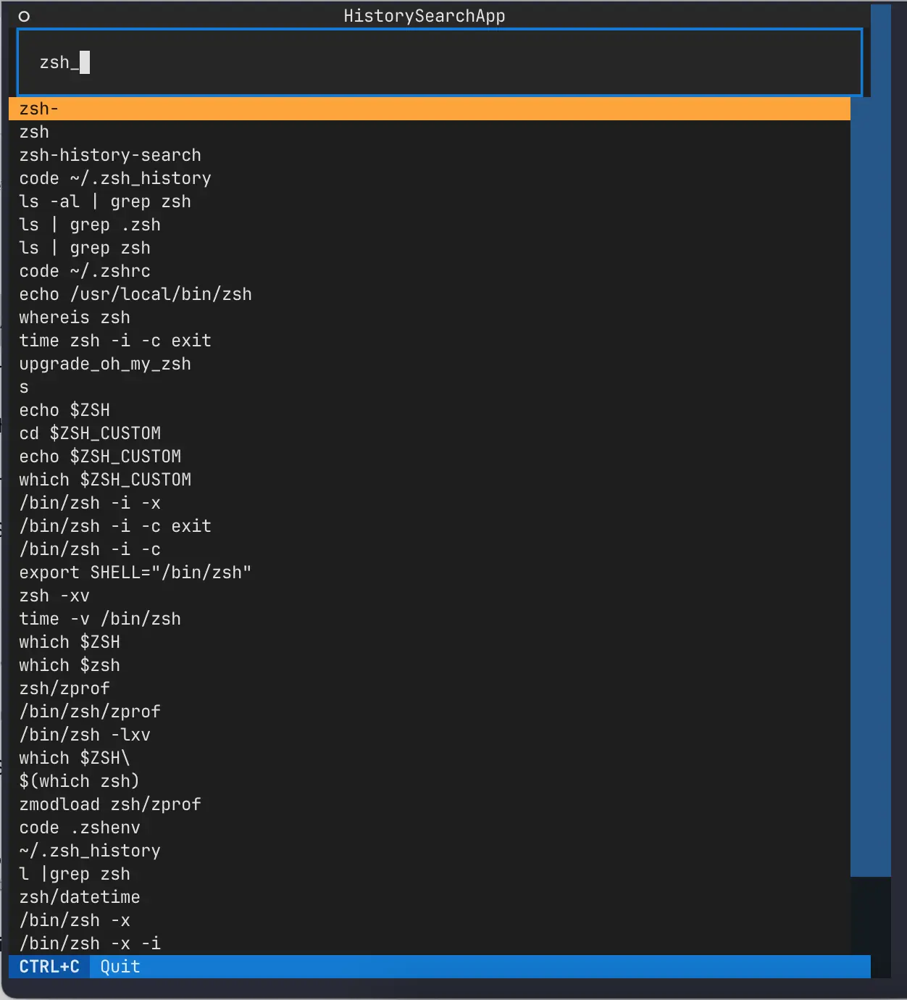

# history-search-textual

textual app trying to improve reverse-i-search

## screenshot



## use

use globally with alias

```sh
# .zshrc
alias myhistory="cd /Users/minhokim/code/python/history-search-textual && source venv/bin/activate && python main.py"
```

```shell
# run
myhistory
```
